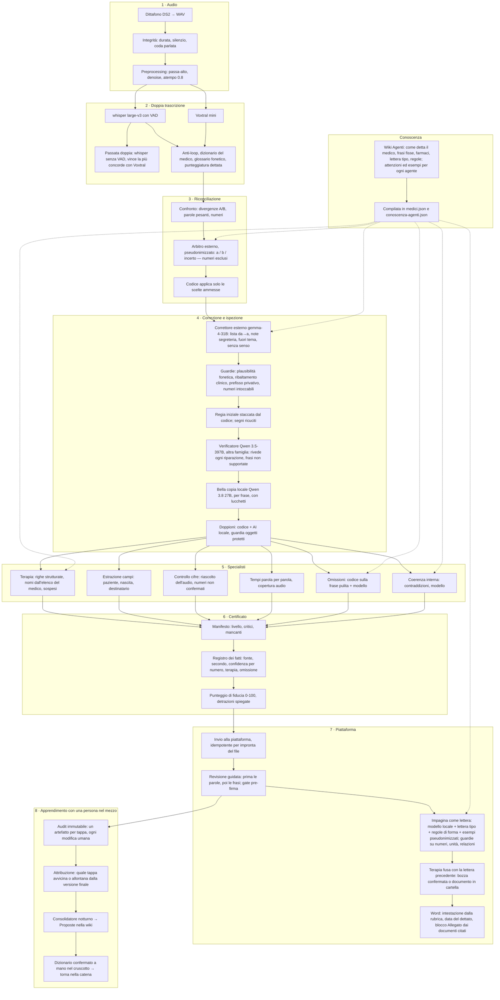

# Schema della catena (per spiegarla a chi non la conosce)

Una pagina da copiare e incollare a chi deve capire com'è fatta la catena oggi, anche un'altra AI. Nessun dato clinico. Il dettaglio di ogni tappa sta nelle pagine linkate; i numeri in [[Misure/Banchi]].

## Principi
- **Due motori di trascrizione** (whisper large-v3 e Voxtral mini) e un **arbitro**: nessun testo è «vero» finché i due non concordano o una persona non decide.
- **L'AI propone, il codice decide.** Ogni proposta di un modello passa da guardie deterministiche (numeri, unità, negazioni, lateralità, farmaci, ribaltamenti clinici). Se una guardia dice no, la proposta non entra.
- **Verificatori di un'altra famiglia** rispetto al modello che corregge, così gli errori non sono correlati.
- **Fiducia calcolata da segnali reali** (accordo dei motori, riascolto dei numeri, esiti dei verificatori), mai chiesta al modello.
- **Ogni fatto sa da dove viene**: fonti, secondo dell'audio, confidenza; in pagina un clic sulla parola fa sentire l'audio.
- **Niente apprendimento automatico**: le correzioni umane producono proposte, una persona le conferma.
- **nLPD**: i modelli locali vedono il testo; verso il cloud parte solo testo PSEUDONIMIZZATO, verso fornitori autorizzati (Infomaniak, Svizzera).

## Il flusso

## Chi fa che cosa

| tappa | chi | dove | proposta o decisione |
|---|---|---|---|
| trascrizione | whisper large-v3, Voxtral mini | Mac dello studio | proposta (due) |
| arbitro | gemma-4-31B | cloud CH, pseudonimizzato | proposta; numeri mai |
| correttore | gemma-4-31B | cloud CH, pseudonimizzato | proposta a lista |
| verificatore, avvocato, omissioni, coerenza | Qwen 3.5-397B (altra famiglia) | cloud CH, pseudonimizzato | proposta |
| bella copia, doppioni, impaginazione | Qwen 3.8 27B | Mac dello studio | proposta |
| pseudonimizzazione | gemma3:12b + regole | Mac dello studio | decisione |
| guardie, ledger, fiducia, manifesto, fusione terapia, Word | codice | Mac dello studio | decisione |
| conferma | persona (medico o segretaria) | piattaforma | decisione finale |

## Che cosa NON c'è, e perché
- **Nessun router** che decide quali controlli fare: girano tutti, su ogni referto (4 minuti, centesimi, nessuno aspetta). Un punto che può saltare un controllo è un rischio senza risparmio.
- **Nessun retrieval** dalla wiki a ogni chiamata: la conoscenza del medico e dell'agente è compilata nei prompt, misurata meglio del recupero a blocchi ([[Agenti/Come funziona]]).
- **Nessun apprendimento automatico**: mai una correzione umana che cambia i prompt da sola ([[Decisioni/Registro]]).
- **Nessun modello locale più grande**: provati Nemotron, gemma3:27b, medgemma, Baichuan; Qwen 3.8 27B resta il migliore sul Mac da 24 GB.

## Come si misura
Suite permanente di 38 casi «catastrofici» sul codice; banchi sintetici per arbitro (15/15), terapia (8/8), omissioni (8/9 modello, 2/9 codice, 0 falsi), coerenza (5/5, 0 falsi), forma della lettera (12/12); referti veri confrontati con la lettera della segretaria tappa per tappa con i soli booleani dell'audit. Ogni difetto vero diventa una regola di codice, una voce di dizionario o un'attenzione nella wiki, e un caso nella suite.
