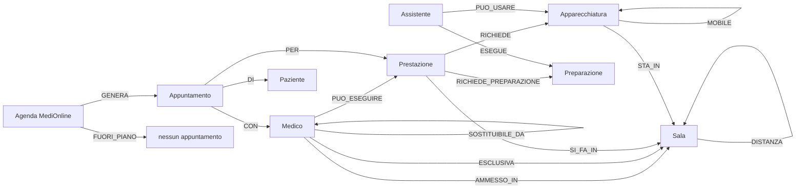
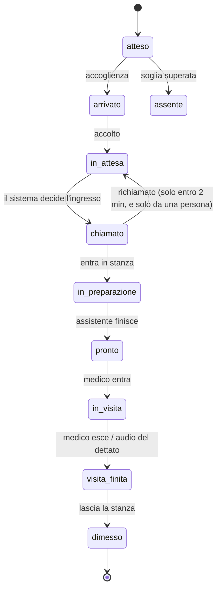
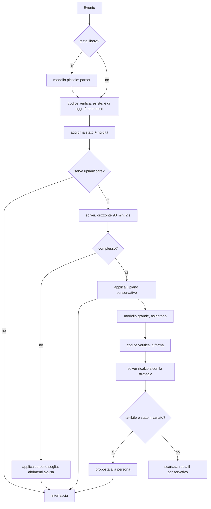
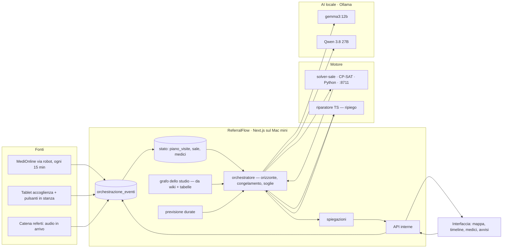

# Orchestrazione di sale, medici e pazienti

Il piano operativo per passare dal «piano delle sale» di oggi — una stanza per medico — a un sistema in cui **la stanza si assegna al paziente e il medico si sposta**. Un gemello digitale dello studio: chi è dove adesso, chi entra dopo, di quanto è in ritardo chi, e che cosa cambia nei prossimi sessanta minuti.

Il documento è un piano di sviluppo, non una descrizione: entità, stati, eventi, vincoli, funzione obiettivo, motore, orizzonte mobile, ritardi, previsione delle durate, ruolo dei due modelli, controllo umano, interfaccia, API, pseudocodice, una giornata d'esempio con otto medici, e le fasi di costruzione. Riprende tutto quello che nella pagina [[Medici/Sale]] è già deciso e lo trasforma in vincoli del nuovo motore.

## Stato di costruzione (16.9.2026)

Tutte e sei le fasi hanno il loro codice, scritto in un giorno su richiesta dello studio («fai tutte le fasi senza fermarti»). **Quello che non si può fare in un giorno sono i criteri di uscita**, che sono misure su settimane di giornate vere: restano scritti nel §15 e vanno misurati prima di fidarsi di ciascuna fase. In pratica:

| Fase | Che cosa c'è | Che cosa manca per dirla chiusa |
|---|---|---|
| 0 · vedere | eventi e stati (`stato.ts`, tabelle 058), tablet **Accoglienza** e pagina **Stanza** nel prototipo, il segnale dal dettato (`referti/upload` → `visita_finita`), mappa in tempo reale | utenti veri al posto di `admin@demo.ch`; una settimana di eventi registrati dal personale e confrontati con l'orologio |
| 1 · misurare e riparare | `durate_osservate` scritte a ogni visita finita, stimatore (`previsione.ts`), riparatore (`riparatore.ts`, 9 prove), spiegazioni da frasi fisse (`spiega.ts`), avvisi | una settimana di durate vere per dire se l'ingresso stimato batte l'ora teorica |
| 2 · il piano del mattino | grafo (`grafo.ts`) da [[Medici/Sale]] e [[Medici/Prestazioni e sale]], servizio **CP-SAT** (`solver-sale/`, launchd su :8711), baseline dal cron dell'agenda e dal pulsante; la sera il confronto è nelle versioni del piano | la pagina delle prestazioni è una proposta: lo studio la deve correggere; 20 giornate senza violazioni; il giudizio del personale |
| 3 · l'orizzonte mobile | ripianificazione a ogni evento sull'orizzonte di 90 min, congelamento per stato e per vicinanza, soglie di comunicazione, comandi (blocca, non spostare, sala fuori servizio, medico resta, priorità, forza, visita breve, ripristina), movimento dei medici, ingresso intelligente | due settimane di misura: attesa mediana in calo e meno di 10 modifiche comunicate al giorno |
| 4 · escalation | il piccolo interpreta il testo dell'accoglienza e verifica contro l'elenco di oggi; il grande, asincrono, propone una strategia in forma fissa che il solver ricalcola; proposte da confermare | proposte vere da giudicare: nessuna ancora, perché nessun ritardo ha superato la soglia |
| 5 · prevedere | fattore d'ora (si accende da 30 casi per fascia), prima visita, `npm run banco-durate` che confronta mediana e regressione a uno fuori | il banco dice «troppo poche osservazioni»: il predittivo resta spento finché non batte la mediana di un minuto |

Prima misura, sulla giornata vera del 16.9: **56 visite, baseline in 1,45 s con CP-SAT (ottimo), 0 senza sala**, 5 appuntamenti con colore senza prestazione (durata dal catalogo di base). Le ripianificazioni in giornata rispondono in 10-25 ms. I dettagli in [[Misure/Banchi]].

## 0. Che cosa cambia e che cosa resta

**Cambia il verso della domanda.** Oggi: «di chi è la Sala 4?». Domani: «dove entra questo paziente, e quando ci arriva il suo medico?». Il medico diventa una risorsa mobile: mentre finisce in una stanza, il paziente successivo viene preparato in un'altra, e lui si sposta senza tempi morti. È quello che l'agenda dice già in modo implicito — un medico con tre fette alla stessa ora non ha tre pazienti sul lettino, ne ha uno in visita e due in preparazione — e che il piano attuale non sapeva rappresentare.

**Resta tutto quello che è una regola dello studio.** Le righe di [[Medici/Sale]] non spariscono: diventano vincoli. «Vera Lucia Paiocchi sempre e solo in Sala 1» è un medico che *non* è mobile, e il motore lo sa. «Tiziano Moccetti in Sala 4 o Sala 5» è l'elenco delle stanze fra cui il solver può scegliere per i suoi pazienti. «Labor fuori dal piano» è un'agenda che non genera appuntamenti da collocare. Le regole restano scritte nella pagina, in italiano, e il codice le legge.

**Resta la filosofia.** L'AI propone, il codice verifica, il solver applica i vincoli, la persona decide quando serve. Nessun modello può scavalcare un vincolo, e niente si applica senza essere stato ricalcolato dal solver dopo la proposta.

**Resta la sola lettura da MediOnline.** L'agenda è lì e il robot la legge ([[Piattaforma/Robot agenda MediOnline]]); il gemello digitale non scrive in MediOnline. Gli stati che MediOnline già porta — *fissato, arrivato, in corso, trattato* — sono eventi preziosi, ma arrivano ogni 15 minuti: per il tempo reale servono altre due fonti, dette al §7.

**Un principio sopra tutti: stabilità prima di ottimalità.** Il sistema che sposta un paziente ogni volta che trova una soluzione migliore di due minuti fa il caos in corridoio. Si preferisce un piano leggermente peggiore ma stabile, comprensibile, e che cambia solo quando cambiare serve. Ogni peso, soglia e regola qui sotto è scritta con questo verso.

## 1. Il modello dello studio

### 1.1 Il grafo

Il grafo serve a dare contesto: chi può fare cosa, dove, con che cosa, insieme a chi. **Non decide**: decide il solver, che dal grafo prende i vincoli. Sta in Postgres come tabelle normali e viene caricato in memoria a ogni giornata (e ricaricato quando cambia una pagina wiki o una tabella).



**Nodi**

| Nodo | Da dove viene oggi | Che cosa aggiunge il progetto |
|---|---|---|
| Medico | `providers` con `ruolo = medico` | competenze, mobilità (sì/no), stanze ammesse, tempo di spostamento personale |
| Assistente | `providers` con `ruolo = collaboratore` (Cassani, Paveri, Bronz) | quali preparazioni sa fare, quali apparecchi usa |
| Paziente | `patients` e i pazienti «solo agenda» | niente di clinico qui: solo l'anagrafica minima e i flag strutturali (prima visita, mobilità ridotta) |
| Appuntamento | `appointments`, specchio dell'agenda MediOnline | i campi di pianificazione (§2), in una tabella separata perché l'agenda resta in sola lettura |
| Sala | `studio_risorse` con `tipo = sala`, già con `posti` | funzione, apparecchi fissi, tempo di ripristino, stato operativo |
| Apparecchiatura | `studio_risorse` con `tipo = apparecchio` | fissa in una stanza o mobile, tempo di setup |
| Prestazione | `prestazioni_catalogo` (riconosciuta dal **colore** dell'agenda) | durata attesa, preparazione, sale compatibili, apparecchi richiesti |
| Preparazione | nuovo | chi la fa, quanto dura, se occupa la stanza |
| Vincolo | le righe in testa a [[Medici/Sale]] e i comandi delle persone (§11) | validità (sempre / oggi), autore |

**Archi, e da dove si leggono**

| Arco | Significato | Fonte |
|---|---|---|
| `PUO_ESEGUIRE(medico, prestazione)` | il medico è abilitato | nuova pagina wiki `Medici/Prestazioni e sale` |
| `AMMESSO_IN(medico, sala)` | fra quali stanze il solver può scegliere per i suoi pazienti | riga `Solo in:` di [[Medici/Sale]] |
| `ESCLUSIVA(medico, sala)` | la stanza è sua e di nessun altro, e lui non va altrove | riga `Sempre e solo:` |
| `SOSTITUIBILE_DA(medico, medico)` | un altro medico può prendere il paziente al posto suo | **assente per default**; si scrive esplicitamente, per coppia, e vale solo con conferma umana (§8.6) |
| `SI_FA_IN(prestazione, sala)` | dove quella prestazione può avvenire | `Medici/Prestazioni e sale`; con eccezione per persona (la risonanza di Paiocchi sta in Sala 1) |
| `RICHIEDE(prestazione, apparecchio)` | senza quello strumento non si fa | idem |
| `STA_IN(apparecchio, sala)` / `MOBILE` | l'ecografo è in Sala 5, l'ECG gira | `studio_risorse` |
| `RICHIEDE_PREPARAZIONE(prestazione, prep, minuti, chi)` | prima del medico serve un assistente per N minuti nella stanza | `Medici/Prestazioni e sale` |
| `DISTANZA(sala, sala)` | secondi di spostamento | tabella `distanze_sale`; default 60 s, le Sport più lontane se lo studio lo dice |
| `FUORI_PIANO(agenda)` / `FUORI_PIANO(prestazione)` | non genera appuntamenti da collocare | righe `Agende fuori dal piano:` e `Prestazioni fuori dal piano:` |

**Quello che il grafo permette di rispondere**, e che il solver usa come dominio delle variabili: per un appuntamento (medico M, prestazione P) le stanze possibili sono `SI_FA_IN(P) ∩ AMMESSO_IN(M)` (o `{ESCLUSIVA(M)}` se esiste), gli apparecchi da prenotare sono `RICHIEDE(P)`, la preparazione è `RICHIEDE_PREPARAZIONE(P)` e chi può farla è chi ha `ESEGUE` verso quella preparazione.

### 1.2 La pagina wiki nuova: `Medici/Prestazioni e sale`

Stessa forma delle altre pagine lette a runtime: una sezione per prestazione, campi in elenco puntato. Proposta di partenza, che lo studio corregge:

```
## Visita cardiologica
- Durata: 20
- Preparazione: pressione e peso, 3 minuti, assistente
- Sale: tutte
- Apparecchi: nessuno

## Ecocardiogramma
- Durata: 30
- Preparazione: spogliato, gel, elettrodi, 5 minuti, assistente
- Sale: Sala 5
- Apparecchi: ecografo
- Medici: Daniela Cassani, Georgios Moschovitis, Marco Moccetti

## Ergometria
- Durata: 30
- Preparazione: elettrodi e pressione, 10 minuti, assistente
- Sale: Sport 1, Sport 2, Sport 3
- Apparecchi: cicloergometro
- Ripristino: 5

## Holter ECG 24h
- Durata: 15
- Preparazione: nessuna
- Sale: tutte
- Medico: non serve
```

`Medico: non serve` è la posa di un Holter: occupa un assistente e una stanza per 15 minuti, e nessun medico. Il solver lo tratta come intervallo di stanza senza intervallo di medico.

## 2. L'appuntamento come unità centrale

Tutto ruota attorno all'appuntamento, non alla stanza del medico. L'agenda MediOnline resta specchiata in `appointments` (sola lettura, il robot la sovrascrive); la pianificazione sta in una tabella a parte, **una riga per appuntamento per versione del piano**.

```sql
create table piano_visite (
  id                 uuid primary key default gen_random_uuid(),
  piano_id           uuid not null references piani_giornata(id),   -- la versione del piano
  appointment_id     uuid not null references appointments(id),
  patient_id         uuid,                       -- null per i pazienti «solo agenda»
  medico_id          uuid references providers(id),
  prestazione_id     uuid references prestazioni_catalogo(id),
  -- tempi
  durata_prevista    int not null,               -- dal catalogo, minuti
  durata_stimata     int not null,               -- dalla previsione (§9), aggiornata
  ora_teorica        timestamptz not null,       -- l'ora dell'agenda
  ingresso_previsto  timestamptz,                -- quando il paziente entra in stanza
  inizio_stimato     timestamptz,                -- quando il medico arriva
  fine_stimata       timestamptz,
  -- risorse
  sala_id            uuid references studio_risorse(id),
  apparecchi         uuid[] not null default '{}',
  assistente_id      uuid references providers(id),
  preparazione_min   int not null default 0,
  ripristino_min     int not null default 0,
  -- governo
  priorita           smallint not null default 0,   -- 0 normale, 1 alta, 2 urgenza
  rigidita           smallint not null default 0,   -- 0 flessibile … 3 congelato (§5)
  vincoli            jsonb not null default '[]',   -- i comandi umani che lo riguardano
  perche             jsonb not null default '{}',   -- perché è qui e non altrove (§13)
  created_at         timestamptz not null default now()
);
```

Le tre ore hanno tre significati e non si confondono: **teorica** è quella scritta in agenda e non cambia mai; **ingresso previsto** è quando il paziente entra nella stanza; **inizio stimato** è quando il medico ci arriva. La differenza fra le ultime due è la preparazione, o l'attesa dentro la stanza — che va tenuta piccola (§8).

## 3. Gli stati

### 3.1 Il paziente (per appuntamento)

| Stato | Che cosa vuol dire | Rigidità | Chi lo produce |
|---|---|---|---|
| `atteso` | non ancora arrivato | 0 | piano del mattino |
| `arrivato` | è in studio, non ancora accolto | 0 | accoglienza (tablet) o stato MediOnline «arrivato» |
| `in_attesa` | in sala d'attesa, accolto | 0 | accoglienza |
| `chiamato` | gli è stato detto di andare in una stanza | 2 | il sistema, confermato da chi chiama |
| `in_preparazione` | è nella stanza con l'assistente | 3 | pulsante in stanza |
| `pronto` | preparato, aspetta il medico | 3 | pulsante in stanza |
| `in_visita` | il medico è dentro | 3 | pulsante in stanza o stato MediOnline «in corso» |
| `visita_finita` | il medico è uscito, il paziente ancora in stanza | 3 | pulsante in stanza, oppure **l'arrivo dell'audio del dettato** (§7) |
| `dimesso` | ha lasciato la stanza | — | pulsante in stanza; stato MediOnline «trattato» |
| `assente` | non è venuto | — | accoglienza, o teorica + soglia |
| `annullato` | tolto dall'agenda | — | robot MediOnline |

La colonna **rigidità** è la regola del §5 in forma di numero: da `chiamato` in poi il paziente non si sposta più; da `in_preparazione` non si tocca nemmeno l'ora.

### 3.2 La sala

| Stato | Significato |
|---|---|
| `libera` | vuota e pronta |
| `riservata` | il piano ci ha messo un ingresso nei prossimi minuti; nessuno dentro |
| `in_preparazione` | assistente e paziente dentro |
| `occupata_pronto` | paziente pronto, medico non ancora arrivato |
| `occupata_visita` | medico dentro |
| `da_ripristinare` | paziente uscito, serve il ripristino (letto, ergometro) |
| `bloccata` | una persona l'ha bloccata per oggi (§11) |
| `fuori_servizio` | guasta, o in uso per altro |

### 3.3 Il medico

| Stato | Significato |
|---|---|
| `assente` | oggi non ha appuntamenti, o non è ancora arrivato |
| `disponibile` | in studio, nessuna visita in corso |
| `in_visita` | in una stanza con un paziente |
| `in_spostamento` | fra due stanze (dura i secondi della `DISTANZA`) |
| `in_pausa` | pausa dichiarata (a mano) |
| `fermo_in_sala` | una persona ha detto «questo medico resta qui» (§11) |

Più il numero che conta sopra tutti: **`ritardo_accumulato`** in minuti, ricalcolato a ogni evento come `fine_reale − fine_stimata` della visita in corso, sommato ai precedenti non ancora assorbiti (§8).

### 3.4 Le transizioni



La freccia `chiamato → in_attesa` esiste, ma la può tirare solo una persona: il sistema non richiama mai un paziente che ha già chiamato.

## 4. Il piano del mattino

Alle 06:30, dopo il giro del robot che ha letto l'agenda di oggi, il sistema costruisce la **baseline**: un piano intero della giornata, versione 0, con tutti i campi del §2 riempiti per ogni appuntamento.

Che cosa stabilisce:

- per ogni paziente: **quale stanza**, **quando entra**, **quando arriva il medico**, **quando finisce**;
- per ogni medico: la **sequenza** di pazienti e stanze — «Rego: Sala 4 → Sala 3 → Sala 4 → Sport 2» — con gli spostamenti;
- per ogni assistente: le preparazioni in ordine;
- quali stanze **restano libere** e quando (per urgenze e per assorbire ritardi);
- dove stanno i **tempi cuscinetto**: il solver è pagato per lasciarne uno ogni N visite per medico (peso in §6), e quei buchi sono la prima cosa che assorbe un ritardo.

Il piano del mattino è una previsione, non un ordine: a partire dal primo evento della giornata comincia a cambiare, ma **solo nell'orizzonte vicino** (§8) e **solo per quel che non è congelato** (§5). La versione 0 resta in tabella per sempre: serve a misurare, la sera, quanto la giornata è andata diversamente da com'era prevista, e perché.

Il piano del mattino è calcolato dal solver con l'orizzonte intero e un limite di 60 secondi. Se il solver non risponde (servizio spento, orizzonte troppo grande), la baseline la fa il **ripiego deterministico** (§5.5) — che è l'evoluzione dell'`assegnaVisite` di oggi — e la pagina lo dice.

## 5. Il constraint solver

### 5.1 Scelta

**OR-Tools CP-SAT**, in Python, come servizio locale sul Mac (`solver-sale`, `127.0.0.1:8711`, launchd come gli altri). Non è installato: la ruota per il Python 3.14 di Homebrew va verificata al momento — se non c'è, il servizio gira su un 3.12 dedicato, separato dalla catena dei referti. Il resto della piattaforma è TypeScript e gli parla via HTTP con un contratto piccolo (§12).

Perché non un LLM: il calcolo ha vincoli duri, e un modello di linguaggio non garantisce niente. Perché non solo il greedy di oggi: quando si ottimizza su otto medici, otto stanze e centoventi visite con ordine, stanze e cuscinetti da scegliere insieme, il greedy trova un piano, il solver trova un piano **buono** e sa dire che i vincoli sono rispettati.

### 5.2 Variabili

Per ogni appuntamento `a` nell'orizzonte:

- `inizio[a]` intero, minuti dalla mezzanotte, dominio `[ora_teorica − anticipo_max, ora_teorica + ritardo_max]`;
- `sala[a][s]` booleano per ogni stanza `s` compatibile (dal grafo); `exactly_one`;
- `durata[a]` costante = `durata_stimata` (§9);
- intervallo di **stanza**: `[inizio − prep, inizio + durata + ripristino)`, opzionale per stanza (`sala[a][s]`);
- intervallo di **medico**: `[inizio, inizio + durata)`;
- intervallo di **assistente**: `[inizio − prep, inizio)` se c'è preparazione;
- intervallo di **apparecchio** mobile: come quello di stanza, per ogni apparecchio richiesto.

Il medico **non è una variabile**: è quello dell'agenda. Diventa variabile solo per gli appuntamenti che una persona ha marcato `sostituibile` e solo fra i medici con arco `SOSTITUIBILE_DA` (§8.6).

### 5.3 Vincoli duri

Impediscono le situazioni impossibili. Nessun peso: o sono rispettati o non c'è piano.

| Vincolo | Come si scrive |
|---|---|
| un medico in una stanza sola alla volta | `NoOverlap` sugli intervalli di medico dello stesso medico |
| un paziente per stanza (o `posti` pazienti) | `NoOverlap` sugli intervalli di stanza, o `Cumulative` con capacità `posti` |
| stanza compatibile con la prestazione | dominio di `sala[a]` = `SI_FA_IN ∩ AMMESSO_IN` |
| medico abilitato | escluso a monte: se `PUO_ESEGUIRE` manca, l'appuntamento va fra le **eccezioni** (§10), non nel solver |
| apparecchio già occupato | `NoOverlap` sugli intervalli di apparecchio |
| assistente in una stanza sola | `NoOverlap` sugli intervalli di assistente |
| spostamenti fisicamente possibili | per ogni coppia `(a, b)` dello stesso medico: `inizio[b] ≥ fine[a] + DISTANZA(sala[a], sala[b])` **oppure** `inizio[a] ≥ fine[b] + DISTANZA(sala[b], sala[a])` (disgiunzione con un booleano d'ordine) |
| preparazione possibile | `inizio[a] − prep ≥ arrivo[a]` quando il paziente è già arrivato; `≥ ora_teorica − anticipo_ingresso` altrimenti |
| stanza esclusiva | `ESCLUSIVA(m, s)` ⇒ `sala[a] = s` per ogni `a` di `m`, e nessun `a` di altri in `s` |
| stanza bloccata / fuori servizio | tolta dal dominio nell'intervallo dichiarato |
| congelamento | per `rigidita ≥ 2`: `sala[a]` fissa; per `rigidita = 3`: anche `inizio[a]` fisso (§5.4) |
| comandi umani | ogni comando del §11 è una uguaglianza o un intervallo tolto dal dominio |
| ordine clinico | se una prestazione dipende da un'altra dello stesso paziente lo stesso giorno (ECG prima della visita), `inizio[b] ≥ fine[a]` |

### 5.4 Il congelamento

La rigidità di un appuntamento è il massimo fra quella dello **stato** (§3.1) e quella del **tempo** che manca al suo inizio stimato:

| Manca | Rigidità dal tempo | Effetto nel solver |
|---|---|---|
| è in corso, o ≤ 0 min | 3 | stanza e ora fisse |
| ≤ 10 min | 2 | stanza fissa; l'ora può slittare solo in avanti e di poco (peso altissimo) |
| ≤ 30 min | 1 | tutto libero, ma ogni cambio costa molto |
| ≤ 60 min | 0 | libero, cambio a costo normale |
| oltre | 0 | fuori orizzonte: si muove **a blocco** (§8.3), non si ripianifica |

Soglie in `orchestrazione_parametri`, con questi default.

### 5.5 Il ripiego deterministico

Quando il servizio del solver non risponde entro il limite (2 s in giornata, 60 s al mattino), risponde il codice TypeScript: l'evoluzione dei tre giri di `assegnaVisite` in `src/lib/sale.ts`, che oggi già assegna stanze vuote proprie, poi ammesse, poi accavallamento su sé stessi, e non mette mai due medici nella stessa stanza. Nel nuovo motore diventa il **riparatore**: prende il piano precedente, congela quel che va congelato e sistema solo quel che è cambiato. È testato, spiegabile, e non ottimizza — per questo è un ripiego e non il motore. La pagina scrive «piano dal riparatore, solver non raggiunto».

## 6. La funzione obiettivo

Un'unica somma pesata, coi pesi in scala tale da rispettare l'ordine di importanza (ogni livello vale almeno dieci volte il successivo, così un termine basso non compra mai un termine alto). Tutti i pesi stanno in `orchestrazione_parametri` e si vedono nella pagina Studio.

| # | Termine | Che cosa misura | Peso di partenza |
|---|---|---|---|
| 1 | vincoli obbligatori | — sono duri, non nel costo — | ∞ |
| 2 | sicurezza e fattibilità | preparazioni sotto il minimo, spostamenti sotto la distanza: **anche questi duri** | ∞ |
| 3 | pazienti già sistemati | ogni cambio di stanza o d'ora per `rigidita ≥ 2` | 100 000 |
| 4 | attesa dei pazienti | `Σ max(0, inizio_stimato − max(ora_teorica, arrivo))` in minuti | 100 |
| 5 | ritardi | `Σ max(0, inizio_stimato − ora_teorica)` per paziente **e** ritardo residuo del medico a fine orizzonte | 80 |
| 6 | stanze occupate inutilmente | minuti di `occupata_pronto` oltre `anticipo_ingresso`, e stanze aperte con una sola visita | 20 |
| 7 | spostamenti dei medici | numero di cambi di stanza consecutivi per medico | 10 |
| 8 | modifiche al piano comunicato | ogni appuntamento con stanza o ingresso diversi dalla versione comunicata (\|Δ ingresso\| in minuti + 15 per cambio stanza) | 30 |
| 9 | propagazione del ritardo | ritardo del medico che arriva all'ultimo appuntamento dell'orizzonte (penalizza il non aver assorbito) | 40 |
| 10 | uso delle stanze | stanze lasciate libere in fasce di picco (premio negativo piccolo), cuscinetti tenuti (premio) | 5 |

Due note che non sono dettagli:

- Il termine 8 è quello che fa la **stabilità**: cambiare l'ingresso di un paziente di 3 minuti costa 90, e un'attesa di 3 minuti costa 300 — quindi il solver sposta solo quando lo spostamento risparmia un'attesa vera. Le soglie di comunicazione (§8.4) filtrano anche il resto.
- Il termine 3 non è un vincolo duro apposta: in un'emergenza (stanza fuori servizio con dentro un paziente) il solver deve poter spostare anche un congelato, pagando 100 000 — e quella soluzione arriva alla persona come proposta da confermare, mai applicata da sola (§10).

## 7. Gli eventi in tempo reale

Ogni evento è una riga in `orchestrazione_eventi` (solo inserimenti, mai modifiche), aggiorna lo stato, e decide se serve ripianificare. Tre fonti, in ordine di affidabilità:

| Fonte | Che cosa porta | Latenza |
|---|---|---|
| **Pulsanti in stanza** (uno schermo o un tablet per stanza, tre tasti: *in preparazione · pronto · finito*) e **tablet all'accoglienza** (*arrivato · chiamato · assente*) | gli stati del §3.1 | immediata |
| **La catena dei referti** | l'arrivo dell'audio di un dettato = quel medico ha appena finito una visita: `visita_finita` per l'appuntamento in corso di quel medico. È un segnale che esiste già, gratis, e per i medici che dettano subito è il più preciso di tutti | 1-2 min |
| **Robot MediOnline** | `arrivato`, `in_corso`, `trattato`, annullamenti, appuntamenti aggiunti | fino a 15 min: giro ogni quarto d'ora ([[Piattaforma/Automazioni]]); in giornata si porta a 2-3 min se MediOnline regge |

Senza la prima fonte il gemello è cieco per un quarto d'ora alla volta: il tablet e i pulsanti sono la **prima cosa da costruire** (fase 0, §15), prima del solver.

Il catalogo degli eventi:

| Evento | Effetto sullo stato | Ripianifica? |
|---|---|---|
| `paziente_arrivato` | `arrivato`; `arrivo[a] = now` | sì, se in anticipo o in ritardo oltre soglia |
| `paziente_in_ritardo` (soglia teorica + N min senza arrivo) | resta `atteso`, l'appuntamento diventa candidato al riordino | sì |
| `paziente_assente` | `assente`; la stanza e il medico si liberano | sì |
| `paziente_chiamato` | `chiamato`, rigidità 2 | no |
| `preparazione_iniziata` / `pronto` | rigidità 3 | no |
| `visita_iniziata` | medico `in_visita`; `inizio_reale` | ricalcolo stime, ripianifica se `inizio_reale − inizio_stimato > soglia` |
| `visita_quasi_finita` (opzionale, il medico lo tocca 5 min prima) | anticipa la chiamata del prossimo | sì, solo l'ingresso del prossimo |
| `visita_piu_lunga` (derivato: `now > fine_stimata` e nessun `finito`) | `ritardo_accumulato += 1` al minuto | sì, ogni `passo_ritardo` minuti (default 5) |
| `visita_finita` | medico `disponibile` o `in_spostamento`; `fine_reale`; si registra la durata (§9) | sì |
| `medico_in_ritardo` (arrivo, pausa) | dichiarato a mano, in minuti | sì |
| `sala_libera` / `sala_occupata` | dai pulsanti; l'occupata senza piano è un'anomalia (§10) | sì |
| `sala_fuori_servizio` / `sala_bloccata` | tolta dal dominio | sì, orizzonte intero |
| `apparecchio_indisponibile` | idem | sì |
| `urgenza` | appuntamento nuovo con `priorita = 2`, medico indicato o «chiunque abilitato» | sì, con il termine 3 pagabile |
| `appuntamento_aggiunto` / `annullato` (dal robot) | entra o esce | sì |

Regola anti-caos: gli eventi si accodano e il solver gira **al massimo una volta ogni `intervallo_min_ripianifica`** (default 30 s) — un solo giro per tutti gli eventi arrivati nel frattempo.

## 8. I ritardi

### 8.1 Il caso base

Una visita era prevista di 15 minuti. Il sistema, credendo il medico libero fra 15, ha fatto entrare il paziente successivo in un'altra stanza, che ora è `pronto`. La visita dura 20.

Che cosa **non** succede: il paziente pronto non viene fatto uscire. È `rigidita 3`: stanza e ora fisse. Il solver non può toccarlo.

Che cosa succede: al minuto 16 parte l'evento derivato `visita_piu_lunga`; `ritardo_accumulato` del medico sale di uno al minuto; al minuto 20 la visita finisce, il ritardo è 5. Il piano dei prossimi 60 minuti si ricalcola con il medico che parte 5 minuti dopo. Il paziente pronto lo vede arrivare con 5 minuti di attesa dentro la stanza — che è il caso normale e accettato: `anticipo_ingresso` è proprio fatto per assorbire questo.

### 8.2 La progressione

Con `anticipo_ingresso = 8 min` e le soglie di default:

| Ritardo | Che cosa cambia | Chi viene avvisato |
|---|---|---|
| **+5** | niente per chi è già dentro. Il prossimo non ancora chiamato entra 5 minuti dopo: era previsto alle 10:40, entra alle 10:45. Nessun avviso: sotto `soglia_avviso` (default 8) | nessuno |
| **+10** | l'ingresso del prossimo slitta di 10. Se il medico ha un cuscinetto nell'ora, il solver lo consuma e i successivi non slittano. Avviso: «Rego +10 min» | chi guarda la mappa |
| **+20** | ora conviene **non far entrare** il prossimo all'ora prevista: resterebbe 20 minuti in una stanza pronta. Il sistema lo tiene in sala d'attesa e la stanza resta `libera` (o va a un altro medico, se la compatibilità c'è). Prova le strategie di assorbimento (§8.5). Avviso: «Rego +20 min · P-17 resta in attesa · Sala 3 libera fino alle 11:05» | mappa + accoglienza |
| **+40** | il ritardo supera `soglia_escalation` (default 30): il solver produce 2-3 piani alternativi (riordino dei flessibili, prestito di stanza, stessa sequenza spostata) e li passa al modello grande (§10.2) per una proposta motivata; intanto applica il **più conservativo** (tutto slitta di quel che non è assorbibile) perché il tempo reale non aspetta il 27B. Avviso alla segreteria: «Rego +40 min: 3 pazienti aspettano oltre 20 minuti. Proposta in arrivo» | segreteria, e il medico stesso |

### 8.3 Fuori dall'orizzonte: a blocco

Gli appuntamenti oltre l'orizzonte (default 90 min) **non si ripianificano**: si spostano tutti insieme del ritardo residuo del medico a fine orizzonte, senza cambiare stanza né ordine. Entrano nell'orizzonte a mano a mano che il tempo passa, e lì vengono ripianificati davvero. È questo che impedisce al sistema di riscrivere la giornata intera a ogni evento.

### 8.4 Quando dirlo alle persone

Un cambiamento esiste per le persone solo se supera una soglia. Sotto, il sistema lo applica in silenzio e non cambia il piano comunicato:

- ingresso spostato di **meno di `soglia_comunicazione`** (default 5 min): silenzio;
- da 5 a 15: avviso nella mappa, il paziente non viene informato;
- oltre 15, o cambio di stanza: avviso all'accoglienza, che decide se dirlo al paziente.

Il **piano comunicato** (versione `comunicata_at`) è quello contro cui si misura il termine 8 dell'obiettivo. Viene aggiornato solo quando una modifica supera la soglia: così una serie di piccoli aggiustamenti non fa deriva.

### 8.5 Assorbire prima di propagare

Prima che un ritardo si propaghi, il solver — che ha tutte queste mosse a disposizione perché sono variabili sue — le prova nell'ordine in cui costano meno:

1. **cuscinetto**: il medico ha un buco nei prossimi 60 min → si consuma;
2. **stanza alternativa**: il prossimo paziente entra in un'altra stanza compatibile, così la preparazione parte anche se la stanza prevista è ancora occupata;
3. **riordino** fra pazienti flessibili dello stesso medico: chi è già in attesa da più tempo passa avanti a chi è in anticipo; mai un paziente `chiamato` o oltre;
4. **preparazione anticipata**: l'assistente prepara il successivo mentre il medico è ancora dentro, in una stanza libera;
5. **visita più corta**: solo se una persona lo ha detto (comando «visita breve», §11): il sistema non abbrevia da solo una prestazione;
6. **altro medico**: solo con arco `SOSTITUIBILE_DA` e conferma umana (§8.6);
7. **propagazione**: quel che resta slitta.

Ogni mossa usata finisce nel `perche` dell'appuntamento e nella spiegazione (§13): «Il ritardo di 15 minuti di Rego è stato assorbito con la Sala 3 e invertendo P-21 e P-22».

### 8.6 L'altro medico

La sostituzione è l'unica mossa che tocca il rapporto medico-paziente, e il sistema non la fa mai da solo. Serve un arco esplicito `SOSTITUIBILE_DA(m1, m2)` nella pagina wiki (chi può sostituire chi, per quali prestazioni), e la proposta arriva a una persona come **da confermare**, con il motivo. Se nessuno conferma entro `attesa_conferma` (default 3 min) il piano resta quello senza sostituzione.

## 9. La previsione delle durate

Ogni `visita_finita` scrive una riga in `durate_osservate` (prestazione, medico, ora del giorno, giorno della settimana, durata reale, flag strutturali del paziente: prima visita sì/no, mobilità ridotta sì/no). **Niente di clinico**: non il motivo, non la diagnosi, non il testo.

Lo stimatore è statistico, e lo resta finché non ci sono dati per fare di meglio:

```
durata_stimata(a) =
  se n(prestazione, medico) ≥ 8:   mediana(prestazione, medico)
  altrimenti se n(prestazione) ≥ 8: mediana(prestazione) + scarto_medico
  altrimenti:                       durata_da_catalogo
  × fattore_ora_del_giorno          (solo quando n per fascia ≥ 30, altrimenti 1)
  + 5 min se prima_visita           (finché non è misurato)
```

`scarto_medico` è la mediana delle differenze fra le durate reali di quel medico e quelle attese, su tutte le prestazioni. Il fattore d'ora si accende solo con dati abbastanza: prima era un'ipotesi («il pomeriggio si accumula»), e le ipotesi non entrano nei calcoli.

Regola della casa, la stessa della catena dei referti: **niente si addestra da solo**. Le mediane si ricalcolano ogni notte, si vedono in una pagina («Durate misurate», per prestazione e medico, con quanti casi), e lo studio può fissare a mano un valore che il sistema deve usare al posto della misura. La parte predittiva (un modello che usa più fattori insieme) è una fase successiva e si valuta col banco: se non batte la mediana, non entra.

## 10. Il ruolo dei due modelli

### 10.1 Il piccolo — gemma3:12b, sempre acceso

Fa quello che il codice non sa fare: capire testo. Mai il calcolo.

- **interpreta un evento scritto**: la segretaria scrive «Rossi è arrivato ma deve fare prima il prelievo» → `{evento: paziente_arrivato, paziente: <id>, vincolo: dopo(Labor)}`; il codice verifica che il paziente esista e sia atteso oggi, altrimenti chiede;
- **traduce un comando** in linguaggio naturale in uno dei comandi del §11;
- **scrive la spiegazione** quando il diff strutturato è troppo articolato per un modello a frasi fisse (§13);
- **classifica un'anomalia**: una stanza `occupata` che il piano dava libera, un pulsante premuto nell'ordine sbagliato → propone la lettura più probabile, la persona conferma.

Tempi: un prompt corto, risposta in 2-6 secondi. Va bene per la segreteria, non sta nel giro del solver.

### 10.2 Il grande — Qwen 3.8 27B, solo su chiamata

Non gira mai per una modifica ordinaria. Viene chiamato **solo** quando:

- il solver ha trovato **più piani equivalenti** (stesso costo entro il 2 %) che differiscono in modo che una persona noterebbe (riordini, stanze diverse);
- il ritardo di un medico supera `soglia_escalation`;
- ci sono **vincoli in conflitto** (il solver non trova soluzione: un comando umano rende impossibile un altro);
- si accumulano **eccezioni** (≥ 3 anomalie aperte nello stesso quarto d'ora);
- una persona chiede «che cosa conviene fare?».

Riceve uno **stato compatto e strutturato** (mai testo clinico: pazienti come codici, prestazioni come tipi, minuti, stanze) e i piani candidati del solver; risponde con una **strategia** in forma fissa — quale piano, quali mosse del §8.5, in che ordine, e il perché in tre righe. Il codice legge la forma fissa come fa `leggiProposta` oggi, scarta quel che non è nel formato, e **il solver ricalcola** con la strategia come vincolo aggiuntivo. Se il ricalcolo non è fattibile, la strategia si butta e si tiene il piano conservativo.

Due fatti pratici, misurati nei banchi di settembre ([[Misure/Banchi]]): il 27B ci mette da uno a otto minuti e sfratta gli altri modelli dalla memoria. Quindi l'escalation è **asincrona**: il tempo reale intanto applica il piano conservativo; la proposta arriva quando arriva, con un numero di versione dello stato; se nel frattempo lo stato è cambiato, la proposta si scarta senza applicarla. E mentre gira, la catena dei referti aspetta — il piano di sale non deve rubare la GPU a un referto in trascrizione, quindi l'escalation controlla prima se la catena è al lavoro e in quel caso rinuncia e lo dice.

### 10.3 Il flusso



## 11. Il controllo umano

Ogni comando diventa un **vincolo con autore e scadenza** (fine giornata, salvo detto altrimenti) in `orchestrazione_comandi`, e il solver ripianifica il resto attorno. Un comando non si discute: se rende impossibile un altro, il sistema lo dice e chiede quale dei due togliere.

| Comando | Vincolo che produce |
|---|---|
| **blocca questo paziente** | `rigidita = 3` per l'appuntamento: stanza e ora fisse |
| **non spostare questo appuntamento** | `rigidita = 2`: stanza fissa, ora solo in avanti |
| **blocca questa sala** | stanza fuori dominio per tutti tranne chi c'è già |
| **sala fuori servizio** | stanza fuori dominio, chi c'era dentro va ripianificato (proposta da confermare) |
| **questo medico rimane qui** | `sala[a] = s` per tutti gli `a` del medico da adesso |
| **cambia priorità** | `priorita` dell'appuntamento; l'urgenza paga il termine 3 |
| **forza questa assegnazione** | `sala[a] = s`, `inizio[a] = t`: il solver la tratta come congelata |
| **visita breve** | `durata_stimata = durata_breve` della prestazione, per quell'appuntamento |
| **ignora questa proposta** | la proposta del modello grande va in `scartata_da`; non si ripropone |
| **ripristina il piano precedente** | la versione precedente torna «corrente»; i comandi dati dopo restano |
| **sostituibile** | apre la mossa §8.6 per quell'appuntamento, con i medici della pagina |

I comandi si danno dalla mappa (clic sulla stanza o sul paziente) o scrivendoli in Cleo, che li traduce col modello piccolo e li mostra da confermare prima di applicarli. Ogni comando resta scritto con chi l'ha dato: per questo servono **utenti veri** invece del solo `admin@demo.ch` — è un prerequisito della fase 0.

## 12. Architettura e API



**Componenti software** (tutti nel repo, salvo il solver):

| Componente | Dove | Che cosa fa |
|---|---|---|
| `src/lib/orchestrazione/grafo.ts` | TS, puro, testato | legge wiki e tabelle, costruisce il grafo, risponde alle domande del §1 |
| `src/lib/orchestrazione/stato.ts` | TS | le macchine a stati del §3, la rigidità, le transizioni ammesse |
| `src/lib/orchestrazione/orizzonte.ts` | TS, puro | quali appuntamenti entrano nel solver, quali si muovono a blocco, soglie di comunicazione |
| `src/lib/orchestrazione/previsione.ts` | TS, puro | lo stimatore del §9 |
| `src/lib/orchestrazione/riparatore.ts` | TS, puro | il ripiego deterministico (dall'attuale `assegnaVisite`) |
| `src/lib/orchestrazione/spiega.ts` | TS, puro | dal diff fra due piani alle frasi |
| `src/app/api/orchestrazione/*` | Next.js | le API qui sotto |
| `solver-sale/` | Python, launchd | CP-SAT; contratto JSON; nessun accesso al DB |
| `public/prototipo/` | JS | mappa, timeline, medici, avvisi, tablet, pulsanti |

**API interne** (tutte sotto sessione; ruoli: segreteria per eventi e comandi, medico per i pulsanti, admin per i parametri):

| Metodo e rotta | Corpo | Risposta |
|---|---|---|
| `POST /api/orchestrazione/eventi` | `{tipo, appointment_id?, sala_id?, medico_id?, minuti?, testo?}` | `{ok, stato, ripianificato: bool, versione}` |
| `GET /api/orchestrazione/stato` | — | sale, medici, pazienti con stato e prossimo passo; `versione` |
| `GET /api/orchestrazione/piano?da=&a=&versione=` | — | le `piano_visite` nell'intervallo; senza `versione` la corrente |
| `POST /api/orchestrazione/comandi` | `{comando, ...parametri}` o `{testo}` | `{ok, vincolo, ripianificato}` oppure `{da_confermare, interpretazione}` |
| `POST /api/orchestrazione/proposte/:id` | `{azione: accetta \| ignora}` | `{ok}` |
| `GET /api/orchestrazione/spiegazioni?da=` | — | le spiegazioni recenti |
| `GET/PUT /api/orchestrazione/parametri` | i pesi e le soglie | — |

**Contratto del solver** (`POST http://127.0.0.1:8711/risolvi`):

```json
{
  "adesso": 634,
  "orizzonte": [634, 724],
  "appuntamenti": [{"id": "…", "medico": "m3", "prestazione": "visita", "durata": 22,
                    "teorica": 640, "arrivo": 631, "prep": 3, "ripristino": 0,
                    "sale_possibili": ["s3", "s4"], "apparecchi": [], "assistente_possibili": ["a1"],
                    "rigidita": 0, "sala_fissa": null, "inizio_fisso": null,
                    "comunicato": {"sala": "s4", "ingresso": 637}}],
  "medici": [{"id": "m3", "libero_da": 641, "in_sala": "s4", "ritardo": 6}],
  "sale": [{"id": "s3", "posti": 1, "libera_da": 634, "bloccata": []}],
  "distanze": {"s3|s4": 1, "s3|sport1": 3},
  "pesi": {"attesa": 100, "ritardo": 80, "stanza_inutile": 20, "spostamento": 10, "modifica": 30, "propagazione": 40, "uso": 5, "congelato": 100000},
  "limite_ms": 2000,
  "quanti_piani": 1
}
```

Risposta: `{stato: "OTTIMO" | "FATTIBILE" | "NESSUNA_SOLUZIONE" | "TEMPO", costo, piani: [{appuntamenti: [{id, sala, ingresso, inizio, fine}], medici: [{id, sequenza: [...]}]}], termini: {attesa: …}}`. Con `quanti_piani: 3` restituisce le soluzioni alternative entro il 2 % per l'escalation.

## 13. Le spiegazioni

Ogni modifica applicata o proposta porta un `perche` **strutturato** — `{causa: "visita_piu_lunga", medico: "m3", minuti: 8, mosse: ["stanza_alternativa:s3", "riordino:P-21<>P-22"], congelati_rispettati: true}` — e una **frase**. La frase la scrive il codice da frasi fisse, per i casi ordinari:

> «P-22 è stato spostato di 8 minuti perché la visita precedente di Rego sta durando più del previsto. È rimasto in sala d'attesa per non occupare inutilmente la Sala 3.»

> «Il ritardo di 15 minuti di Rego è stato assorbito usando la Sala 4 e invertendo i prossimi due pazienti. Nessun altro appuntamento si è mosso.»

Solo quando il diff contiene più di tre mosse, o una proposta del modello grande, la frase la scrive gemma3:12b **dal `perche` strutturato**, mai dallo stato intero — così non può inventare una causa che non c'è. Le spiegazioni si accumulano in `orchestrazione_spiegazioni` con la versione del piano, e sono quello che la sera dice com'è andata la giornata.

## 14. L'interfaccia

Quattro viste, una sola pagina, sopra il prototipo attuale (la pagina «Sale» evolve, non si rifà).

**A. La mappa dello studio.** Le otto stanze disegnate nella disposizione vera (una piantina semplice, non una lista): per ogni stanza il paziente di adesso, il medico di adesso, lo stato come colore discreto e parola, e sotto, più piccolo, *il prossimo*: chi entra, con quale medico, fra quanti minuti. Le stanze libere dicono per quanto. Clic sulla stanza: i comandi del §11.

**B′. L'agenda per medico** (aggiunta il 16.9 su richiesta dello studio). La stessa pianificazione, una colonna per medico: su ogni visita la stanza prevista e l'ora in cui il medico ci arriva; una tacca tratteggiata segna l'ora dell'agenda quando il piano la sposta, e il blocco scrive «+N min». Solo le visite in studio: telefonate e prestazioni fuori sede stanno nella pagina Agenda.

**B. La timeline.** Quella di oggi, con due cambiamenti: le righe sono le **stanze** e i blocchi sono i **pazienti** — ogni blocco col colore e le iniziali del suo medico, come già fatto il 16.9 — e sopra i blocchi corrono i **fili dei medici**: una linea sottile per medico che va di stanza in stanza. Un ritardo si vede come un blocco che si allunga e un filo che si sposta a destra. Le modifiche rispetto al piano comunicato sono segnate con un bordo tratteggiato dov'era il blocco prima.

**C. Il movimento dei medici.** Una riga per medico: adesso, poi, poi. «Rego · Sala 4 (P-12, finisce ~10:41) → Sala 3 (P-17, pronto) → Sala 4 (P-21, 11:05)». È la vista che un medico guarda uscendo da una stanza.

**D. Gli avvisi.** Frasi corte, nell'ordine in cui arrivano, sopra la mappa, mai più di tre insieme: «Rego +12 min» · «P-17 resta in Sala 3» · «P-21: ingresso 10:40 → 10:52» · «Sala 4 usata per assorbire il ritardo» · «Piano dei prossimi 30 minuti aggiornato». Clic: la spiegazione intera.

**Il tablet all'accoglienza** è una lista dei pazienti di oggi in ordine d'ora con tre tasti: *arrivato · chiamato · assente*, e la riga del sistema sotto ogni nome: «entra in Sala 3 alle 10:52, con Rego». **Il pulsante in stanza** (uno schermo piccolo o il telefono del medico): *in preparazione · pronto · finito*, più il nome del paziente e del prossimo. Niente altro: chi è in stanza non deve leggere.

Regole di stile come nel resto ([[Piattaforma/Convenzioni UI]]): colori appena accennati, stato sempre scritto a parole, niente animazioni che distraggono, il ritardo in minuti con il segno.

## 15. Le fasi

Ogni fase ha un banco e un criterio di uscita. La fase successiva non parte se il criterio non è misurato.

| Fase | Che cosa si costruisce | Criterio di uscita |
|---|---|---|
| **0 · vedere** (2-3 settimane) | eventi e stati (§3, §7), tablet accoglienza, pulsanti in stanza, il segnale dal dettato, utenti veri per la segreteria, tabella eventi, mappa in sola lettura con lo stato vero | per una settimana, il 90 % delle visite ha `visita_iniziata` e `visita_finita` registrati entro 2 minuti dal vero (a campione, contro l'orologio) |
| **1 · misurare e riparare** (2 settimane) | durate osservate e stimatore (§9), riparatore TS (§5.5) che aggiorna gli ingressi previsti in tempo reale, spiegazioni da frasi fisse, avvisi | l'ingresso stimato batte l'ora teorica: errore mediano sull'inizio vero sotto i 5 minuti, misurato su una settimana |
| **2 · il piano del mattino** (3 settimane) | grafo (§1) con la pagina `Prestazioni e sale`, servizio CP-SAT, baseline della giornata (§4) con vincoli duri e obiettivo (§6), confronto sera contro mattina | la baseline non viola nessun vincolo su 20 giornate vere passate; il personale la giudica «plausibile» su 5 giornate senza correzioni oltre 3 |
| **3 · l'orizzonte mobile** (3 settimane) | ripianificazione in giornata (§8), congelamento (§5.4), soglie di comunicazione, comandi umani (§11), movimento dei medici | su due settimane: attesa mediana dei pazienti in calo rispetto alla fase 1, **e** numero di modifiche comunicate per giornata sotto 10 |
| **4 · escalation** (2 settimane) | i due modelli (§10), proposte da confermare, spiegazioni scritte dal piccolo | ogni proposta del grande è stata ricalcolata dal solver prima di essere mostrata (100 %); almeno metà delle proposte accettate dal personale |
| **5 · prevedere** (aperta) | fattore d'ora, flag strutturali, un modello predittivo se batte la mediana al banco; la piantina disegnata | il predittivo entra solo se riduce l'errore mediano di almeno 1 minuto sul banco |

Prerequisiti che non sono fasi ma senza cui non si parte: i **colori dell'agenda** non ancora abbinati a una prestazione (11 colori, 84 appuntamenti al mese, [[Misure/Banchi]]) — senza prestazione non c'è durata né stanza compatibile; e il **giro del robot** in giornata da 15 minuti a 2-3, o si accetta che gli stati MediOnline arrivino tardi e valga il tablet.

## 16. Una giornata

**06:30** — il robot ha letto l'agenda. Il grafo si carica: 9 medici di cui 8 presenti oggi, 2 assistenti, 8 stanze, 6 prestazioni con colore, i vincoli di [[Medici/Sale]]. Lo stimatore dà le durate. Il solver fa la baseline in 41 secondi: 126 appuntamenti, nessuna violazione, 7 cuscinetti, Sala 3 libera dalle 11 alle 13.

**07:45** — la segreteria apre il tablet: la lista di oggi, con accanto a ogni nome «entra in … alle …, con …».

**08:30** — primi arrivi. `paziente_arrivato` × 6. Nessuna ripianificazione: tutti in orario.

**09:12** — Rego è in Sala 4 con P-12 dalle 08:58, previsto fino alle 09:18. P-17 è `pronto` in Sala 3 dalle 09:10 (entrato 8 minuti prima dell'arrivo previsto del medico).

**09:19** — `visita_piu_lunga`: Rego +1. Poi +2, +3… niente cambia.

**09:24** — Rego esce (`visita_finita` dal pulsante; l'audio del dettato arriva alle 09:26 e conferma). Ritardo 6. Il solver gira in 0,8 s sull'orizzonte 09:24-10:54: P-17 in Sala 3 non si tocca (rigidità 3); P-21, previsto in Sala 4 alle 09:40, entra alle 09:46; nessun avviso (sotto soglia). Rego: Sala 4 → Sala 3 → Sala 4.

**09:50** — Girola, in Sport 2, ha una visita che dura il doppio. +14. Il solver: P-33 resta in sala d'attesa invece di entrare in Sport 3 (avrebbe aspettato 14 minuti dentro); Sport 3 libera fino alle 10:10, va a Franscella che ha un paziente in anticipo. Avviso: «Girola +14 min · P-33 resta in attesa · Sport 3 a Franscella fino alle 10:10». Spiegazione scritta da frasi fisse.

**10:05** — la segreteria scrive in Cleo «la signora dell'eco delle 10:30 ha chiamato, arriva alle 11». Il piccolo la traduce in `paziente_in_ritardo(P-40, 11:00)`, la segreteria conferma. Il solver sposta P-40 alle 11:00 in Sala 5 (l'ecografo è lì) e anticipa P-44 alle 10:30. Un avviso.

**10:40** — urgenza: un paziente con dolore toracico, medico «chiunque abilitato». Il solver paga il termine 3: propone Sala 3 (libera) con Moschovitis, che ha un cuscinetto alle 10:45. Proposta alla segreteria, che accetta. Avviso a Moschovitis sul suo telefono: «10:45 Sala 3 urgenza, poi torni in Sport 1».

**12:10** — Rego ha accumulato +38. Soglia di escalation superata: il solver produce tre piani entro il 2 %, applica il conservativo (tutto slitta di 22, i 16 assorbiti con la Sala 3 e un riordino), e chiama il 27B — che però vede la catena dei referti al lavoro e rinuncia: «escalation rimandata, catena occupata». La segreteria vede il piano conservativo, e va bene così.

**19:10** — chiusura. Le 118 visite fatte scrivono le durate osservate; la mediana della visita cardiologica di Rego passa da 20 a 22. Il confronto mattina-sera: 31 modifiche comunicate, attesa mediana 7 minuti, 3 pazienti oltre i 20 minuti, tutti nel pomeriggio di Rego. Domani la baseline gli dà un cuscinetto in più alle 11.

## 17. L'esempio con otto medici

Un lunedì mattina, 08:30-10:30, i numeri veri dell'agenda del 14.9 arrotondati; pazienti come codici. Otto medici presenti: Paiocchi (Sala 1, esclusiva), Marco Moccetti (Sala 2 o 3), Rego, Girola, Moschovitis, Pedrotti, Franscella (i quattro nelle Sport), Capelli (Sport); più Cassani all'eco in Sala 5. Tiziano Moccetti arriva alle 13.

**Baseline delle 06:30, fetta 09:00-10:00** (V = visita 20', E = eco 30', ERG = ergometria 30' con 10' di preparazione):

| Ora | Sala 1 | Sala 2 | Sala 3 | Sala 4 | Sala 5 | Sport 1 | Sport 2 | Sport 3 |
|---|---|---|---|---|---|---|---|---|
| 09:00 | P-01 · V · **Paiocchi** | P-05 · V · **M.Moccetti** | P-06 · V · M.Moccetti (prep) | P-10 · V · **Rego** | P-14 · E · **Cassani** | P-18 · ERG · **Girola** | P-22 · V · **Pedrotti** | P-26 · V · **Franscella** |
| 09:20 | P-02 · V · Paiocchi | P-06 pronto | P-07 · V · **M.Moccetti** | P-11 · V · **Rego** | — | P-18 in corso | P-23 · V · **Pedrotti** | P-27 · V · **Franscella** |
| 09:30 | — | P-08 · V · **M.Moccetti** | (libera) | — | P-15 · E · **Cassani** | P-19 · V · **Girola** | — | — |
| 09:40 | P-03 · V · Paiocchi | — | P-09 · V · **M.Moccetti** | P-12 · V · **Rego** | — | — | P-24 · V · **Moschovitis** | P-28 · V · **Capelli** |

Le sequenze dei medici in quella fetta: **M. Moccetti** Sala 2 → Sala 3 → Sala 2 → Sala 3 (due stanze, il prossimo sempre in preparazione nell'altra); **Rego** Sala 4 fissa (una stanza gli basta: 20' + 0 prep, nessuno in parallelo); **Girola** Sport 1 (l'ergometria occupa la stanza 40', lui 30'); **Pedrotti / Franscella / Moschovitis / Capelli** ruotano fra Sport 2 e 3 a seconda di chi ha il paziente pronto. Sala 3 è libera alle 09:30 e il solver non la riempie: è il cuscinetto della mattina.

**Rego accumula ritardo.** P-11 previsto 09:20-09:40 in Sala 4; P-12 previsto in Sala 4 alle 09:40, ingresso alle 09:35 (prep 3', anticipo 8' meno la prep).

| Ritardo | Che cosa fa il sistema | Avviso |
|---|---|---|
| **+5** (09:45, P-11 ancora dentro) | P-12 non è ancora entrato in Sala 4 (occupata): il solver lo mette in **Sala 3** — libera, compatibile, a 1 minuto — ingresso 09:42, pronto per le 09:46. Rego esce da Sala 4 alle 09:45 e va in Sala 3. La Sala 4 va in `da_ripristinare` e poi accoglie P-13 | nessuno (sotto soglia) |
| **+10** (09:50, P-11 ancora dentro) | P-12 è già pronto in Sala 3 dalle 09:46: resta. Aspetterà 4 minuti oltre il previsto. P-13, previsto 10:00, slitta a 10:06 in Sala 4; il cuscinetto delle 10:40 di Rego si consuma e P-14, P-15 non slittano | «Rego +10 min» |
| **+20** (10:00, P-11 ancora dentro) | P-12 in Sala 3 aspetta da 14 minuti: non si tocca, ma la spiegazione lo dice. P-13 **non entra** alle 10:06: resta in sala d'attesa; la Sala 4 resta libera e il solver la presta a M. Moccetti per P-09 (compatibile, a 1 minuto da Sala 3) così M. Moccetti libera la Sala 3 prima. Strategie usate: cuscinetto (consumato), stanza alternativa, riordino: P-14 (in anticipo, flessibile) passa avanti a P-13 (non ancora arrivato) | «Rego +20 min · P-13 resta in attesa · Sala 4 a M. Moccetti fino alle 10:15» |
| **+40** (10:20) | escalation. Il solver dà tre piani: (a) tutto slitta di 24 dopo gli assorbimenti; (b) P-15 e P-16 di Rego passano a **Moschovitis** — ma non c'è arco `SOSTITUIBILE_DA`, quindi (b) non esiste nemmeno; (c) Rego salta il cuscinetto delle 11:40 e slitta di 16. Applica (c) come conservativo. Il 27B, libero, propone (c) più uno spostamento di P-17 in Sala 3 alle 10:45 per non far aspettare P-18: il solver ricalcola, è fattibile, la proposta va alla segreteria. Sul tablet: «Rego +40: 3 pazienti oltre 20 min. Proposta: P-17 in Sala 3 alle 10:45 — accetti?» | segreteria e Rego |

Quello che **non è successo** in nessuna riga: nessun paziente già dentro una stanza è stato fatto uscire; nessun paziente è stato spostato due volte; nessun avviso sotto i 5 minuti; nessun medico in due stanze; nessuna sostituzione senza un arco scritto e una persona che dice sì.

## 18. Tabelle nuove (migrazioni 056-060)

```sql
-- 056: il grafo
create table medici_prestazioni  (medico_id uuid, prestazione_id uuid, primary key (medico_id, prestazione_id));
create table prestazioni_sale    (prestazione_id uuid, sala_id uuid, medico_id uuid null,        -- eccezione per persona
                                  primary key (prestazione_id, sala_id, coalesce(medico_id, '00000000-0000-0000-0000-000000000000')));
create table prestazioni_risorse (prestazione_id uuid, risorsa_id uuid, primary key (prestazione_id, risorsa_id));
create table preparazioni        (id uuid primary key, prestazione_id uuid, nome text, minuti int, occupa_sala boolean, ruolo text);
create table distanze_sale       (da uuid, a uuid, secondi int, primary key (da, a));
alter table studio_risorse add column funzione text, add column mobile boolean default false,
                           add column ripristino_min int default 0, add column stato text default 'libera';

-- 057: i piani
create table piani_giornata      (id uuid primary key, studio_id uuid, giorno date, versione int, motivo text,
                                  comunicata_at timestamptz, corrente boolean, costo jsonb, solver text, created_at timestamptz);
-- piano_visite: §2

-- 058: lo stato e gli eventi
create table orchestrazione_stato   (appointment_id uuid primary key, stato text, sala_id uuid, arrivo timestamptz,
                                     inizio_reale timestamptz, fine_reale timestamptz, rigidita smallint, updated_at timestamptz);
create table orchestrazione_eventi  (id bigserial primary key, studio_id uuid, tipo text, appointment_id uuid, sala_id uuid,
                                     medico_id uuid, minuti int, testo text, fonte text, user_id uuid, at timestamptz);
create table orchestrazione_comandi (id uuid primary key, studio_id uuid, comando text, parametri jsonb, user_id uuid,
                                     valido_da timestamptz, valido_a timestamptz, ritirato_at timestamptz);

-- 059: le durate e le spiegazioni
create table durate_osservate       (prestazione_id uuid, medico_id uuid, giorno date, ora smallint, prima_visita boolean,
                                     mobilita_ridotta boolean, minuti int);
create table durate_fissate         (prestazione_id uuid, medico_id uuid null, minuti int, user_id uuid, at timestamptz);
create table orchestrazione_spiegazioni (id bigserial, piano_id uuid, appointment_id uuid, perche jsonb, testo text, at timestamptz);

-- 060: i parametri
create table orchestrazione_parametri (studio_id uuid, chiave text, valore jsonb, primary key (studio_id, chiave));
```

`orchestrazione_eventi` e `orchestrazione_spiegazioni` sono di soli inserimenti, come `audit.*`.

## 19. Pseudocodice dei componenti principali

**Il giro dell'orchestratore**

```
ogni evento e:
  registra(e)                                   -- solo inserimento
  stato = applica(e, stato)                     -- macchina a stati, rifiuta transizioni non ammesse
  se e.tipo in {visita_finita}: registraDurata(e)
  ritardi = ricalcolaRitardi(stato, adesso)     -- per medico: fine_reale − fine_stimata, + residuo
  se serveRipianificare(e, ritardi):            -- tabella del §7
    accoda()

ogni 30 s, se la coda non è vuota:
  orizzonte = [adesso, adesso + 90 min]
  dentro = appuntamenti con inizio_stimato in orizzonte
  congelati = { a in dentro : rigidita(a, adesso) >= 2 }
  fuori = appuntamenti oltre l'orizzonte
  richiesta = costruisci(dentro, congelati, comandi, pesi, grafo, previsione)
  esito = solver.risolvi(richiesta, 2000 ms)  oppure  riparatore.ripara(richiesta)
  se esito.NESSUNA_SOLUZIONE: apriEccezione("vincoli in conflitto", comandi coinvolti); esci
  nuovo = esito.piani[0]
  spostaABlocco(fuori, ritardoResiduo(nuovo))   -- §8.3
  diff = confronta(pianoCorrente, nuovo)
  per ogni cambio in diff:
    se cambio.minuti < soglia_comunicazione e non cambio.stanza: applica in silenzio
    altrimenti: applica, avvisa(cambio), spiega(cambio)
  se complesso(esito, ritardi): escalation(richiesta, esito.piani[0..2])   -- asincrona
  versione += 1
```

**La stima di quando il medico si libera**

```
liberoDa(medico):
  se in_visita:  max(adesso, inizio_reale + durata_stimata(visita_in_corso)) + ritardo_residuo
  se in_spostamento: fine_spostamento
  altrimenti: adesso
```

**Quando far entrare un paziente**

```
ingresso(a):
  arrivoMedico = liberoDa(medico(a)) + distanza(salaPrecedente(medico), sala(a))
  entra = arrivoMedico − anticipo_ingresso − prep(a)
  se arrivoMedico − adesso > soglia_attesa_in_sala (default 15):
      tieniInAttesa(a); libera(sala(a)); riprova al prossimo giro
  altrimenti se paziente(a) è arrivato e sala(a) è libera e assistente disponibile:
      chiama(a, sala(a), entra)      -- da qui rigidità 2
```

**Le strategie di assorbimento** (dentro il solver sono variabili; qui è quello che l'orchestratore chiede di provare e nell'ordine in cui le racconta)

```
assorbi(medico, ritardo):
  residuo = ritardo
  residuo −= cuscinetti(medico, orizzonte)
  per a in prossimi(medico) non congelati:
      se esiste sala alternativa libera e compatibile: consenti(a, sala) ; residuo −= guadagno
  se due flessibili dello stesso medico sono invertibili (chi aspetta da più tempo prima): consenti riordino
  se comando "visita breve" su a: durata(a) = breve
  se arco SOSTITUIBILE e comando "sostituibile": consenti medico alternativo → proposta, non applicazione
  ritorna residuo                                 -- questo, e solo questo, si propaga
```

**Validare una proposta del modello grande**

```
valida(proposta, statoVersione):
  se proposta.versione != statoVersione: scarta("stato cambiato")
  strategia = leggiForma(proposta)               -- come leggiProposta: forma fissa o niente
  per mossa in strategia: se non ammessa(mossa, grafo, comandi, congelati): scarta(mossa)
  esito = solver.risolvi(richiesta + strategia, 2000 ms)
  se esito.NESSUNA_SOLUZIONE: scarta("non fattibile")
  ritorna Proposta(esito.piani[0], perche = strategia.perche, da_confermare = true)
```

## 20. Le eccezioni

Un'eccezione è tutto quello che il modello del §3 non prevede: una stanza segnata occupata che il piano dava libera; un `pronto` senza `in_preparazione`; un medico che entra in una stanza diversa da quella prevista; due `visita_iniziata` per lo stesso medico; un appuntamento la cui prestazione non ha né colore né durata; un comando che rende impossibile un altro.

Per ognuna: si **registra** (evento di tipo `anomalia`), si **prova a leggerla** col piccolo (la lettura più probabile, con una domanda secca alla persona: «Rego è in Sala 3 invece che in Sala 4: lo sposto nel piano?»), e **finché nessuno risponde il piano resta quello di prima**. Le anomalie aperte si vedono nella mappa come un segno sulla stanza o sul medico. Tre aperte nello stesso quarto d'ora sono un criterio di escalation (§10.2), perché vuol dire che il gemello ha perso il contatto con lo studio.

## 21. Che cosa non fa, per scelta

- Non scrive in MediOnline. Se un giorno arriverà una via di scrittura, sarà un progetto a sé.
- Non abbrevia da solo una visita, non cambia da solo un medico, non richiama un paziente già chiamato.
- Non cerca la soluzione perfetta: un piano stabile con 7 minuti di attesa mediana batte un piano ottimo che cambia dieci volte al giorno.
- Non usa testo clinico da nessuna parte: nel grafo, negli eventi, nei prompt entrano codici, tipi, minuti e stanze.
- Non impara da solo: le durate si misurano e si mostrano, e chi decide che cosa usare è lo studio.
